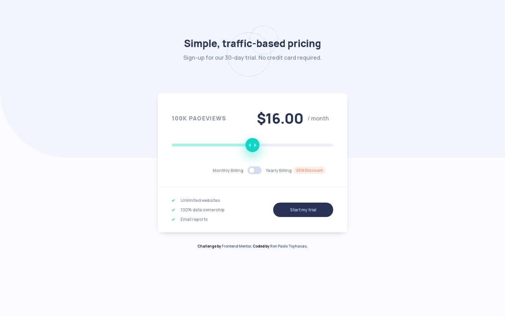

# Frontend Mentor - Interactive pricing component solution

This is a solution to the [Interactive pricing component challenge on Frontend Mentor](https://www.frontendmentor.io/challenges/interactive-pricing-component-t0m8PIyY8). Frontend Mentor challenges help you improve your coding skills by building realistic projects. 

## Table of contents

- [Overview](#overview)
  - [The challenge](#the-challenge)
  - [Screenshot](#screenshot)
  - [Links](#links)
- [My process](#my-process)
  - [Built with](#built-with)
  - [What I learned](#what-i-learned)
  - [Continued development](#continued-development)
  - [Useful resources](#useful-resources)
- [Author](#author)
- [Acknowledgments](#acknowledgments)

## Overview

### The challenge

Users should be able to:

- View the optimal layout for the app depending on their device's screen size
- See hover states for all interactive elements on the page
- Use the slider and toggle to see prices for different page view numbers

### Screenshot

#### Mobile

#### Desktop

### Links

- Solution URL: [https://github.com/rontoyhacao/Interactive-pricing-component](https://github.com/rontoyhacao/Interactive-pricing-component)
- Live Site URL: [https://interactive-pricing-component-rontoyhacao.vercel.app/](https://interactive-pricing-component-rontoyhacao.vercel.app/)

## My process

### Built with

- Semantic HTML5 markup
- CSS custom properties
- [Sass](https://sass-lang.com/)
- Javascript
- Flexbox
- Mobile-first workflow

### What I learned

This project has shown me how DOM Manipulation in Javascript works. In this project, the range slider manipulates elements based on what value is selected. Every value selected on the range slider changes the displayed text on the page which is the price and the pageviews. The toggle button also manipulates by showing the discounted value. This is my first time making a project with this much manipulation of elements and I learned so much about it. I also learned how to use the `order` property in CSS with the price text and the range slider. The position of the two component changes in desktop and mobile. I may not fully understand manipulating the DOM yet but this project has definitely opened the door for me to understand Javascript more and this project could be a hand for my future projects.

### Continued development

Since this project showed me how to manipulate the DOM, I may as well want to focus on it now that I found out that it could do a lot of things in web development.

### Useful resources

- [How To Create a Toggle Switch from w3schools.com](https://www.w3schools.com/howto/howto_css_switch.asp) - This helped me in making the toggle. I could use this pattern in making toggle components in the future.

## Author

- Website - [Ron Paolo Toyhacao](https://www.your-site.com)
- Frontend Mentor - [@rontoyhacao](https://www.frontendmentor.io/profile/rontoyhacao)
- Twitter - [@rontoyhacao](https://twitter.com/rontoyhacao)

## Acknowledgments

I would highly like to thank and give acknowledgement to [Bryan Lee](https://www.frontendmentor.io/profile/BL1133) from Front-end Mentor for his solution. I actually wouldn't be able to make it if it weren't for his solution particularly with DOM manipulation part since I'm still learning JS at the moment. His solution has been a huge help to me in making this project.
